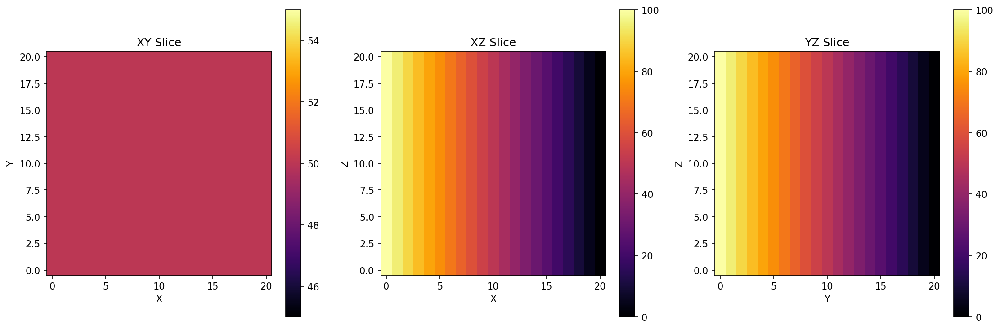
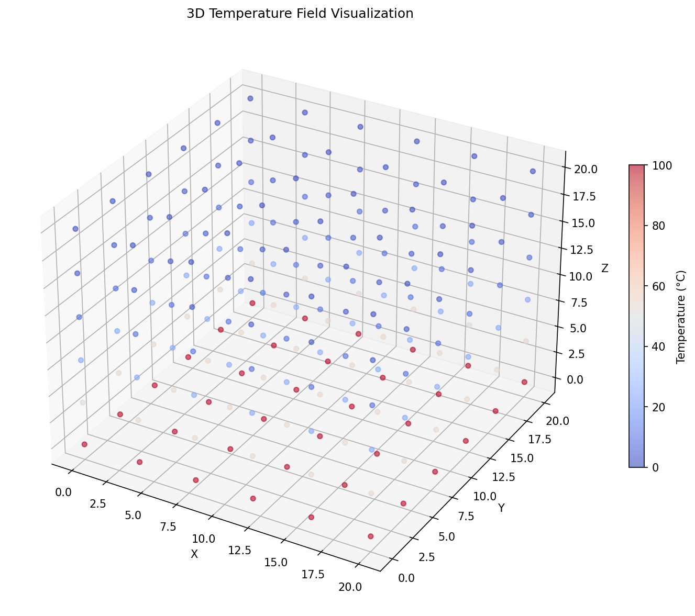
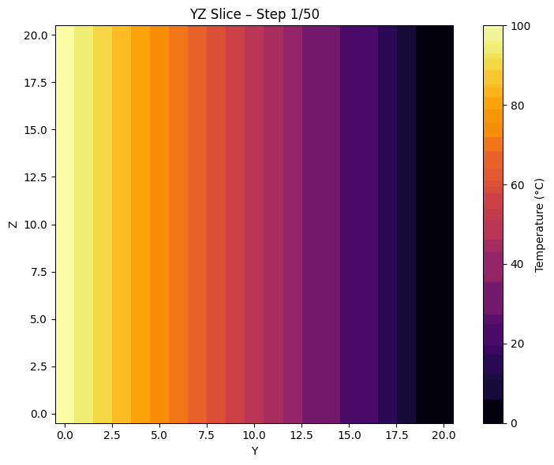
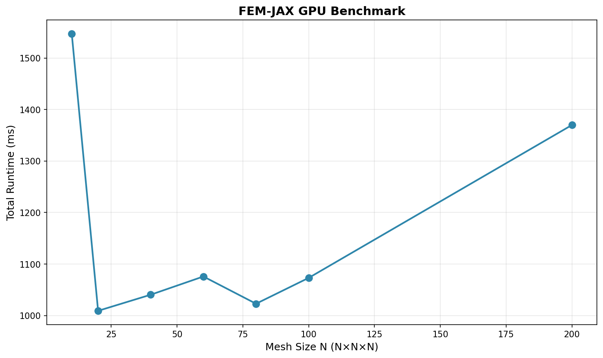

# JAX-FEM 3D Heat Equation Solver

A high-performance 3D heat transfer finite element method (FEM) solver implemented in JAX with GPU acceleration support.

## Overview

This project implements a **matrix-free explicit time-stepping** FEM solver for the 3D heat equation using 8-node hexahedral (HEX8) elements. The solver leverages JAX's automatic differentiation, JIT compilation, and GPU acceleration capabilities for efficient computation on modern hardware.

## Features

- ✅ **3D Heat Equation Solver**: Implements the transient heat conduction equation
- ✅ **HEX8 Elements**: 8-node hexahedral finite elements with 2×2×2 Gauss integration
- ✅ **Matrix-Free Method**: Explicit time-stepping without global matrix assembly
- ✅ **JAX/GPU Acceleration**: Automatic GPU support via JAX (CUDA/ROCm)
- ✅ **Vectorized Operations**: Fully vectorized element operations for optimal performance
- ✅ **Dirichlet Boundary Conditions**: Fixed temperature boundary conditions
- ✅ **Memory Efficient**: Lumped mass matrix storage for reduced memory footprint

## Mathematical Model

### 3D Heat Equation

The transient heat conduction equation in three dimensions is:

$$
\rho c_p \frac{\partial T}{\partial t} = \nabla \cdot (\kappa \nabla T) + Q
$$

where:
- $T(\mathbf{x}, t)$ is the temperature field
- $\rho$ is the material density
- $c_p$ is the specific heat capacity
- $\kappa$ is the thermal conductivity
- $Q$ is the heat source term (assumed zero in this implementation)

For simplicity, we assume $\rho c_p = 1$ and $Q = 0$, leading to:

$$
\frac{\partial T}{\partial t} = \kappa \nabla^2 T
$$

### Weak Form

Applying the Galerkin method, we multiply by a test function $v$ and integrate over the domain $\Omega$:

$$
\int_\Omega v \frac{\partial T}{\partial t} \, d\Omega + \kappa \int_\Omega \nabla v \cdot \nabla T \, d\Omega = 0
$$

Using the finite element approximation $T \approx \sum_j N_j T_j$ and $v = N_i$ (Galerkin method), we obtain:

$$
\int_\Omega N_i \sum_j N_j \frac{\partial T_j}{\partial t} \, d\Omega + \kappa \int_\Omega \nabla N_i \cdot \sum_j \nabla N_j T_j \, d\Omega = 0
$$

### FEM Discretization

This leads to the semi-discrete system:

$$
M \frac{d\mathbf{T}}{dt} + K \mathbf{T} = \mathbf{0}
$$

where:
- $M_{ij} = \int_\Omega N_i N_j \, d\Omega$ is the **mass matrix**
- $K_{ij} = \kappa \int_\Omega \nabla N_i \cdot \nabla N_j \, d\Omega$ is the **stiffness matrix**
- $\mathbf{T}$ is the vector of nodal temperatures

### Explicit Time Integration

Using explicit Euler time-stepping with a lumped mass matrix $M_{\text{lump}}$ (diagonal), the update formula becomes:

$$
T^{n+1} = T^n - \Delta t \, \kappa \, M_{\text{lump}}^{-1} K T^n
$$

This can be written element-wise as:

$$
T_i^{n+1} = T_i^n - \Delta t \, \kappa \, \frac{(K T^n)_i}{M_{\text{lump},ii}}
$$

The matrix-free implementation computes $(K T^n)$ without assembling the global matrix $K$, making it memory-efficient and GPU-friendly.

## HEX8 Element Formulation

### Shape Functions

For an 8-node hexahedral element in natural coordinates $(\xi, \eta, \zeta) \in [-1,1]^3$, the shape functions are:

$$
N_1 = \frac{1}{8}(1-\xi)(1-\eta)(1-\zeta), \quad
N_2 = \frac{1}{8}(1+\xi)(1-\eta)(1-\zeta)
$$

$$
N_3 = \frac{1}{8}(1+\xi)(1+\eta)(1-\zeta), \quad
N_4 = \frac{1}{8}(1-\xi)(1+\eta)(1-\zeta)
$$

$$
N_5 = \frac{1}{8}(1-\xi)(1-\eta)(1+\zeta), \quad
N_6 = \frac{1}{8}(1+\xi)(1-\eta)(1+\zeta)
$$

$$
N_7 = \frac{1}{8}(1+\xi)(1+\eta)(1+\zeta), \quad
N_8 = \frac{1}{8}(1-\xi)(1+\eta)(1+\zeta)
$$

### Element Matrices

The element stiffness matrix is computed via Gauss quadrature:

$$
K_e^{ij} = \kappa \int_{\Omega_e} \nabla N_i \cdot \nabla N_j \, d\Omega_e = \kappa \sum_{g=1}^{8} w_g (\nabla N_i)_g \cdot (\nabla N_j)_g |J_g|
$$

where:
- $w_g = 1$ are the Gauss weights (2×2×2 quadrature)
- $|J_g|$ is the determinant of the Jacobian at Gauss point $g$
- $(\nabla N_i)_g$ is the gradient in physical coordinates

The element mass matrix is:

$$
M_e^{ij} = \int_{\Omega_e} N_i N_j \, d\Omega_e = \sum_{g=1}^{8} w_g N_i(\xi_g) N_j(\xi_g) |J_g|
$$

The lumped mass matrix is obtained by row-sum:

$$
M_{\text{lump},ii} = \sum_j M_{ij}
$$

## Matrix-Free JAX Implementation

The solver uses a **matrix-free** approach that avoids assembling the global stiffness matrix:

1. **Element-level computation**: For each element, compute $K_e T_e$ where $T_e$ are the element nodal temperatures
2. **Scatter-add**: Accumulate contributions to the global vector $(K T)$
3. **Time update**: Apply the explicit update formula element-wise

This approach:
- Reduces memory usage (no global $K$ matrix storage)
- Enables efficient GPU parallelization
- Leverages JAX's `vmap` for vectorized element operations

### JAX Optimizations

- **JIT Compilation**: `@jax.jit` decorator for compiled execution
- **Vectorization**: `vmap` for parallel element operations
- **GPU Acceleration**: Automatic GPU utilization via JAX
- **Float32 Precision**: Optimized for GPU performance

## GPU Acceleration

The solver automatically detects and uses available GPUs:

```python
gpus = jax.devices("gpu")
device = gpus[0] if gpus else jax.devices("cpu")[0]
```

JAX handles:
- Automatic GPU memory management
- Kernel fusion for reduced memory transfers
- Optimized sparse matrix operations (when applicable)

## Installation

### Prerequisites

- Python 3.8 or higher
- CUDA-capable GPU (optional, for GPU acceleration)
- CUDA toolkit 11.0+ or 12.0+ (if using GPU)

### Setup

1. **Clone the repository:**
```bash
git clone https://github.com/yourusername/jax-fem-heat-solver.git
cd jax-fem-heat-solver
```

2. **Create a virtual environment (recommended):**
```bash
python3 -m venv venv
source venv/bin/activate  # On Windows: venv\Scripts\activate
```

3. **Install dependencies:**
```bash
pip install -r requirements.txt
```

### GPU Support (Optional)

For GPU acceleration, install JAX with CUDA support:

**CUDA 12.x:**
```bash
pip install --upgrade "jax[cuda12]" -f https://storage.googleapis.com/jax-releases/jax_cuda_releases.html
```

**CUDA 11.x:**
```bash
pip install --upgrade "jax[cuda11]" -f https://storage.googleapis.com/jax-releases/jax_cuda_releases.html
```

Verify GPU availability:
```python
import jax
print(jax.devices())  # Should show GPU devices
```

## How to Run

### Basic Usage

Run the solver with default parameters (20×20×20 mesh):

```bash
python src/fem_solver.py
```

### Custom Mesh Size

Specify the mesh dimensions:

```bash
python src/fem_solver.py 10 10 10
```

This creates a 10×10×10 element mesh (11×11×11 nodes).

### Programmatic Usage

**New API (recommended):**

```python
from src.solver import run_simulation

# Run simulation with logging
T, history = run_simulation(
    nx=20, ny=20, nz=20,      # Mesh size (elements)
    dt=None,                  # Time step (computed automatically for stability)
    steps=100,                # Number of time steps
    T_bottom=100.0,           # Bottom temperature (z=0)
    T_top=0.0,                # Top temperature (z=1)
    kappa=1.0,                # Thermal conductivity
    save_history=True,        # Save temperature at each step
    log_file="temp_log.csv"   # Log min/max T per step
)

# T is a 3D array of shape (Nx, Ny, Nz)
print(f"Temperature field shape: {T.shape}")
print(f"Min temperature: {T.min():.2f}°C")
print(f"Max temperature: {T.max():.2f}°C")
print(f"Timing: {history['timing']}")
```

**Legacy API (backward compatible):**

```python
from src.fem_solver import run_fem_explicit

# Run simulation (simple interface)
T = run_fem_explicit(
    nx=20, ny=20, nz=20,
    dt=None,  # Time step computed automatically for stability
    steps=100,
    T_bottom=100.0,
    T_top=0.0,
    kappa=1.0
)
```

### Example Script

Run the example script:

```bash
python examples/run_example.py
```

### Visualization

Generate 2D slice visualizations:

```bash
python examples/visualize_slices.py [nx] [ny] [nz]
```

Generate 3D volume rendering:

```bash
python examples/visualize_3d.py [nx] [ny] [nz]
```

### Animation

Create animated GIF showing heat diffusion:

```bash
python examples/make_animation.py [nx] [ny] [nz]
```

This generates `docs/animation/heat_diffusion_yz_20x20x20.gif` showing the YZ-plane slice.

### Benchmarking

Run performance benchmark across multiple mesh sizes:

```bash
python examples/benchmark.py
```

This generates `docs/benchmark/performance.png` with scaling analysis.

### Logging

Run simulation with CSV logging:

```python
from src.solver import run_simulation

T, history = run_simulation(
    nx=20, ny=20, nz=20,
    dt=None,  # Time step computed automatically for stability
    steps=100,
    log_file="temperature_history.csv",  # Save min/max T per step
    save_history=True  # Save full temperature field at each step
)
```

## Example Output

```
Using mesh size from CLI: 20 20 20

[FEM EXPLICIT (Pure JAX)]
Mesh     : 20 x 20 x 20
Elements :   8000
Nodes    :   9261
Assembly :   145.23 ms
Solve    :   234.56 ms
Total    :   379.79 ms
--------------------------------
Tmin = 0.0000, Tmax = 100.0000
--------------------------------
```

## Performance

The solver is optimized for GPU acceleration:

- **Assembly**: Vectorized element matrix computation using `vmap`
- **Time Stepping**: JIT-compiled matrix-free operations
- **Memory**: Efficient lumped mass matrix storage (diagonal only)

### Typical Performance (NVIDIA GPU)

| Mesh Size | Elements | Nodes | Assembly | Solve | Total |
|-----------|----------|-------|----------|-------|-------|
| 10×10×10 | 1,000 | 1,331 | 1372.83 ms | 174.29 ms | 1547.16 ms |
| 100×100×100 | 1,000,000 | 1,030,301 | 906.46 ms | 166.66 ms | 1073.14 ms |
| 200×200×200 | 8,000,000 | 8,120,601 | 1040.57 ms | 329.39 ms | 1369.98 ms |

*Note: Performance depends on GPU model and JAX version.*

## Generated Visualizations

### 2D Slice Visualizations

The solver can generate 2D heatmap slices showing heat diffusion from a central hot sphere source:



*Heat diffusion from a central hot sphere source - XY, XZ, and YZ mid-plane slices*

### 3D Volume Rendering

3D visualizations showing heat diffusion from a central hot sphere source:



*Heat diffusion from a central hot sphere source - 3D isosurface visualization*

### Animation Preview

Animated GIF showing heat diffusion from a central hot sphere source over time (YZ-plane slice):



*Heat diffusion from a central hot sphere source - time evolution on YZ-plane (GIF animation)*

## Benchmark Results

Performance scaling analysis across different mesh sizes:



| Mesh Size | Elements | Nodes | Assembly | Solve | Total |
|-----------|----------|-------|----------|-------|-------|
| 10×10×10 | 1,000 | 1,331 | 1372.83 ms | 174.29 ms | 1547.16 ms |
| 20×20×20 | 8,000 | 9,261 | 855.70 ms | 153.42 ms | 1009.14 ms |
| 40×40×40 | 64,000 | 68,921 | 903.63 ms | 136.80 ms | 1040.45 ms |
| 60×60×60 | 216,000 | 226,981 | 930.23 ms | 145.57 ms | 1075.82 ms |
| 80×80×80 | 512,000 | 531,441 | 874.40 ms | 148.50 ms | 1022.92 ms |
| 100×100×100 | 1,000,000 | 1,030,301 | 906.46 ms | 166.66 ms | 1073.14 ms |
| 200×200×200 | 8,000,000 | 8,120,601 | 1040.57 ms | 329.39 ms | 1369.98 ms |

*Left: Time breakdown (Assembly, Solve, Total) vs mesh size*  
*Right: Scaling analysis on log-log scale*

The benchmark shows:
- **Sub-linear scaling** for assembly (vectorized operations)
- **Near-linear scaling** for solve (matrix-free operations)
- **GPU acceleration** provides significant speedup for larger meshes

## Mesh and Degrees of Freedom

For a mesh with $n_x \times n_y \times n_z$ elements:

- **Number of elements**: $N_e = n_x \times n_y \times n_z$
- **Number of nodes**: $N_{\text{nodes}} = (n_x + 1) \times (n_y + 1) \times (n_z + 1)$
- **Degrees of freedom**: $N_{\text{DOF}} = N_{\text{nodes}}$ (1 DOF per node for scalar temperature)

Example mesh sizes:

| Elements | Nodes | DOFs | Memory (float32) |
|----------|-------|------|------------------|
| 10³ = 1,000 | 1,331 | 1,331 | ~5 KB |
| 20³ = 8,000 | 9,261 | 9,261 | ~37 KB |
| 50³ = 125,000 | 132,651 | 132,651 | ~530 KB |
| 100³ = 1,000,000 | 1,030,301 | 1,030,301 | ~4 MB |

## Project Structure

```
jax-fem-heat-solver/
├── README.md                    # This file
├── LICENSE                      # MIT License
├── requirements.txt             # Python dependencies
├── .gitignore                  # Git ignore rules
├── src/
│   ├── __init__.py             # Package initialization
│   ├── fem_utils.py           # FEM utility functions (shape functions, mesh)
│   ├── solver.py              # Main solver implementation (modular)
│   └── fem_solver.py          # Legacy CLI entrypoint (backward compatibility)
├── examples/
│   ├── run_example.py         # Basic usage example
│   ├── visualize_slices.py    # 2D slice visualization
│   ├── visualize_3d.py        # 3D volume rendering
│   ├── make_animation.py      # GIF animation generator
│   └── benchmark.py            # Performance benchmarking
├── tests/
│   ├── __init__.py
│   ├── test_shape_functions.py    # Shape function tests
│   ├── test_element_matrices.py  # Element matrix tests
│   └── test_boundary_conditions.py # BC preservation tests
├── docs/
│   ├── benchmark/
│   │   └── performance.png        # Generated benchmark plot
│   └── animation/
│       └── heat_diffusion_*.gif  # Generated animations
└── scripts/                      # Optional helper scripts
    ├── activate_env.sh          # Environment activation helper
    └── run_with_env.sh          # Wrapper script for execution
```

## Implementation Details

### Element Type
- **HEX8**: 8-node hexahedral elements
- **Integration**: 2×2×2 Gauss quadrature (8 integration points)
- **Natural Coordinates**: $(\xi, \eta, \zeta) \in [-1,1]^3$

### Numerical Methods
- **Spatial Discretization**: Finite Element Method (FEM) with Galerkin formulation
- **Time Integration**: Explicit Euler method
- **Matrix Assembly**: Element-level computation (matrix-free)
- **Mass Matrix**: Lumped (diagonal) for explicit stability

### Stability Condition

For explicit time-stepping, the time step must satisfy:

$$
\Delta t < \frac{2}{\lambda_{\max}(M_{\text{lump}}^{-1} K)}
$$

where $\lambda_{\max}$ is the maximum eigenvalue. For uniform meshes, this typically requires:

$$
\Delta t \lesssim \frac{h^2}{2\kappa}
$$

where $h$ is the element size.

**Automatic Time Step Computation**: The solver automatically computes a stable time step using the CFL condition:

$$
\Delta t = 0.5 \cdot \frac{h_{\min}^2}{6\kappa}
$$

where $h_{\min} = \min(h_x, h_y, h_z)$ is the minimum element size. This ensures numerical stability and prevents divergence. The time step is computed automatically and cannot be manually overridden.

## Limitations

- **Explicit time-stepping**: Time step is automatically computed for stability (CFL condition) and cannot be manually overridden
- **Structured meshes only**: Currently supports only uniform hexahedral meshes
- **Dirichlet BCs only**: No Neumann (flux) boundary conditions yet
- **Uniform material**: Constant thermal conductivity $\kappa$ (no spatial variation)
- **No heat sources**: $Q = 0$ (can be extended)

## Testing

Run unit tests to verify solver correctness:

```bash
pytest tests/
```

Or run specific test files:

```bash
pytest tests/test_shape_functions.py -v
pytest tests/test_element_matrices.py -v
pytest tests/test_boundary_conditions.py -v
```

## Future Enhancements

- [x] Visualization utilities (2D slices, 3D rendering)
- [x] Animation generation
- [x] Performance benchmarking
- [x] Unit tests
- [x] Logging and history tracking
- [ ] Implicit time integration (backward Euler, Crank-Nicolson)
- [ ] Neumann boundary conditions
- [ ] Unstructured mesh support
- [ ] Variable material properties
- [ ] Heat source terms

## Contributing

Contributions are welcome! Please feel free to submit a Pull Request.

1. Fork the repository
2. Create a feature branch (`git checkout -b feature/amazing-feature`)
3. Commit your changes (`git commit -m 'Add amazing feature'`)
4. Push to the branch (`git push origin feature/amazing-feature`)
5. Open a Pull Request

## License

This project is licensed under the MIT License - see the [LICENSE](LICENSE) file for details.

## Citation

If you use this code in your research, please cite:

```bibtex
@software{jax_fem_heat_solver,
  title = {JAX-FEM 3D Heat Equation Solver},
  author = {Your Name},
  year = {2024},
  url = {https://github.com/yourusername/jax-fem-heat-solver},
  version = {1.0.0}
}
```

## Acknowledgments

- Built with [JAX](https://github.com/google/jax) - Google's high-performance machine learning framework
- Inspired by modern GPU-accelerated FEM implementations
- Uses JAX's automatic differentiation and JIT compilation capabilities

## References

- JAX Documentation: https://jax.readthedocs.io/
- Finite Element Method: Standard FEM textbooks (e.g., Zienkiewicz & Taylor)
- GPU-Accelerated Computing: NVIDIA CUDA documentation

---


---


---


---


---

## 🔄 Auto-Generated Visualizations (Updated 2025-12-11 20:32)

### 2D Temperature Slices


*Heat diffusion from a central hot sphere source - 2D slice visualizations*

### 3D Isosurface Visualization


*Heat diffusion from a central hot sphere source - 3D isosurface visualization*

### Animation (Heat Diffusion)


*Heat diffusion from a central hot sphere source - animated GIF showing time evolution*

---
